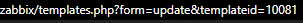

# zabbix_import_excel
Importando Hosts SNMP ou Agent no Zabbix via Excel.

Script foi construído para facilitar o cadastro de Host no Zabbix, tornando o processo mais ágil e evitando erros manuais.


###Como Utilizar?

`Python` https://www.python.org/downloads/windows/

Instale as dependências:
```
pip install -r requirements.txt
```

**Preencha os campos da planilha:**


#Para saber o ID do Grupo ou Template do Zabbix:

Em Dados Coletados > Templates ou Grupo de hosts, passe o mouse em cima para visualizar o id na URL.




Ou execute o info_zabbix.py para buscar os groupip.

python info_zabbix.py
```
import requests
import json

# Configurações
ZABBIX_URL = "URL_Zabbix/zabbix/api_jsonrpc.php"
TOKEN = "TOKEN"

# Monta o payload da API
payload = {
    "jsonrpc": "2.0",
    "method": "hostgroup.get",
    "params": {
        "output": ["groupid", "name"]
    },
    "auth": TOKEN,
    "id": 1
}

# Envia requisição
response = requests.post(ZABBIX_URL, headers={"Content-Type": "application/json"}, data=json.dumps(payload))

# Exibe resultado
if response.status_code == 200:
    grupos = response.json().get("result", [])
    for grupo in grupos:
        print(f"{grupo['groupid']} - {grupo['name']}")
else:
    print("Erro ao consultar API:", response.status_code)
```


Preencha as váriaveis com a URL e Token do seu Zabbix.
```
ZABBIX_URL = "URL_ZABBIX/zabbix/api_jsonrpc.php"
AUTH_TOKEN = "Token"
```

Criar Token = Configuração > Tokens da API > Criar Token

Rode o Script: python IMPORT_HOST_ZABBIX.py


